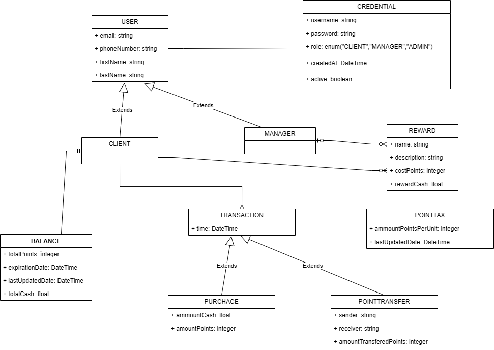

# Objective:

Develop a robust platform for a client loyalty program.

## System roles:

- Client
- Manager

## Summary of functionalities

| **Function**                           | **Description**                                                                                                                                                 | **Role** |
|----------------------------------------|-----------------------------------------------------------------------------------------------------------------------------------------------------------------|----------|
| 1. Register client's transaction       | The client's transaction is registered and details like **amount** and **transaction date**  are stored                                                         | Client   |
| 2. Configure point attribution system  | based on the transaction value, points must be attributed. For instance, There must be brackets. Like, if 1 to 1000.00 MTN might be worth 1 point, and so forth | Manager  | 
| 3. Monitor points per client           | Manager is allowed to see all client's points                                                                                                                   | Manager  |
| 4. Consult total points                | Client must see be able to see the current point balance                                                                                                        | Client   | 
| 5. Trade points for money              | Client has the capability of using trading the points for money. For instance, 1000 point could be equivalent to 100 mt                                         | Client   |
| 6. Create reward and discounts catalog | Manager is responsible for creating rewards. Manager creates the tariffs for the trades.                                                                        | Manager  |
| 7. Points transference                 | Clients should be allowed to transfer points to another client                                                                                                  | Client   |
| 8. Implement RBAC                      | Implement role based access control                                                                                                                             | System   |
| 9. Visualize history of transactions   | User must be able to see his history of transactions                                                                                                            | Client   |
| 9. Visualize all system transactions   | Manages must be able to monitor all transactions on the platform                                                                                                | Client   |

## System entities:

Different transaction types give different ammount of points
type of transaction: levantamento, transferencia, deposito
Total of points - total amount of points a user has ever had;
Available points/balance;
